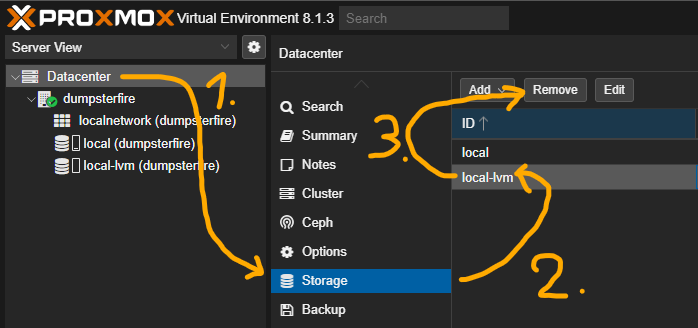
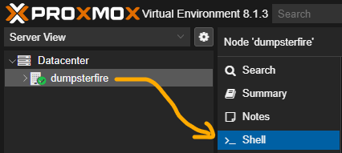
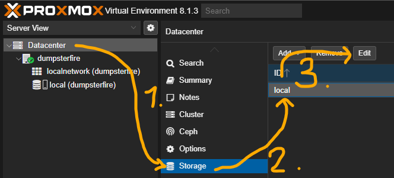
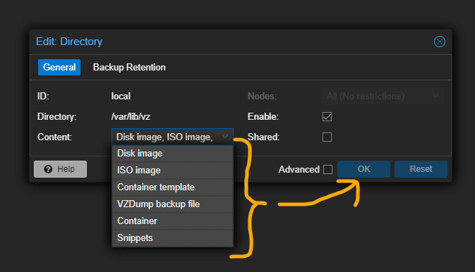

+++
title = 'Remove Proxmox local-lvm'
date = 2024-01-27T16:00:00+01:00
draft = false
categories = [
  'Proxmox',
]
image = 'thumbnail.png'
+++

Starting out with proxmox can be quite challenging especially when you have 2 different storages by default. `local` storage by default is used for ISO images, and Container Templates. `local-lvm` storage by default is used for your VM Disks and Container Volumes. From my pov this is wastefull because I only have one physical disk on my rack which will hold everything either way so I'll be merging both of these into a single `local` storage so I can take full advantage of the disk.

# Do this on a fresh install or make sure that every VM and Container is backed up and deleted because you will be deleting the storage where they are stored

## 1st - Remove local-lvm Storage
Log into the dashboard and then proceed to: *Datacenter > Storage > local-lvm > Remove*



## 2nd - Resize local Storage
Now proceed to: *Node > Shell*



And execute the commands below:

```sh
lvremove /dev/pve/data
lvresize -l +100%FREE /dev/pve/root
resize2fs /dev/mapper/pve-root
```

## 3rd - Edit local Storage Content
Now go back to: *Datacenter > Storage > local-lvm > Edit*



Now check everything in the Content section and your done!



